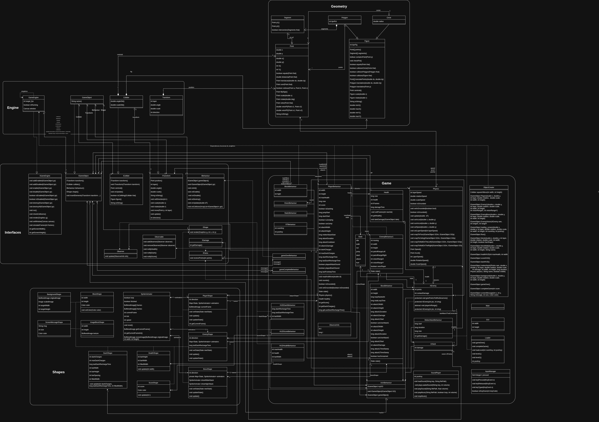

# Java Game Engine

This is a small 2D game built with it's own game engine in plain Java.

It uses Swing/AWT for the window and rendering, a custom game loop, a `GameObject` + `Behaviour` model, collision handling, sprite animation, audio, and simple level loading. The current repo is both the engine itself and a concrete game built on top of it: a side-scrolling action prototype with enemies, a boss, room transitions, a HUD, and game over / game complete states.




## Learned

- game loop timing and frame updates
- object lifecycle management
- transforms, colliders, and collision checks
- sprite animation and simple state machines
- keyboard input and player movement
- enemy behaviour and basic AI
- HUD updates through observers
- level loading and scene transitions
- testing engine pieces in isolation

## What it does

Right now the project already includes the core parts of a playable 2D engine prototype:

- Open a Swing window and render to a `Canvas` with `BufferStrategy`
- Run a custom engine loop at 60 FPS
- Manage layered `GameObject`s
- Attach behaviour, shape, collider, and transform components to objects
- Detect collisions and dispatch collision callbacks
- Spawn, enable, disable, and destroy objects during gameplay
- Load levels dynamically through the loader
- Control a player with movement, jump, dash, and melee attack
- Render animated sprites for the player, enemies, boss, blocks, and background
- Show HUD elements for health, dash charges, and score
- Play background music and sound effects
- Handle game over and game complete screens
- Keep a growing set of JUnit tests for engine, geometry, physics, loader, health, and player behaviour

## Controls

- Left / Right Arrow — move
- D — jump
- A — dash
- S — attack

## Tech stack

**Core**
- Java

**Rendering / UI**
- AWT
- Swing
- Canvas
- BufferStrategy

**Audio**
- Java Sound API

**Testing**
- JUnit 5

## How it is structured

```text
java-game-engine/
├── src/
│   ├── assets/         # sprites and textures
│   ├── engine/         # core engine classes: loop, objects, transforms, colliders, input
│   ├── game/           # gameplay behaviours, physics, enemy/player logic
│   ├── gameManager/    # GUI, level loading, object factory, sound management
│   ├── geometry/       # geometric primitives and collision helpers
│   ├── interfaces/     # engine contracts
│   ├── shapes/         # renderable sprite / HUD / block shapes
│   ├── tests/          # JUnit tests
│   ├── util/           # small helpers
│   └── MegaMain.java   # entrypoint
├── sounds/             # music and sound effects
├── docs/               # javadoc, UML, screenshot
├── .vscode/
└── LICENSE
